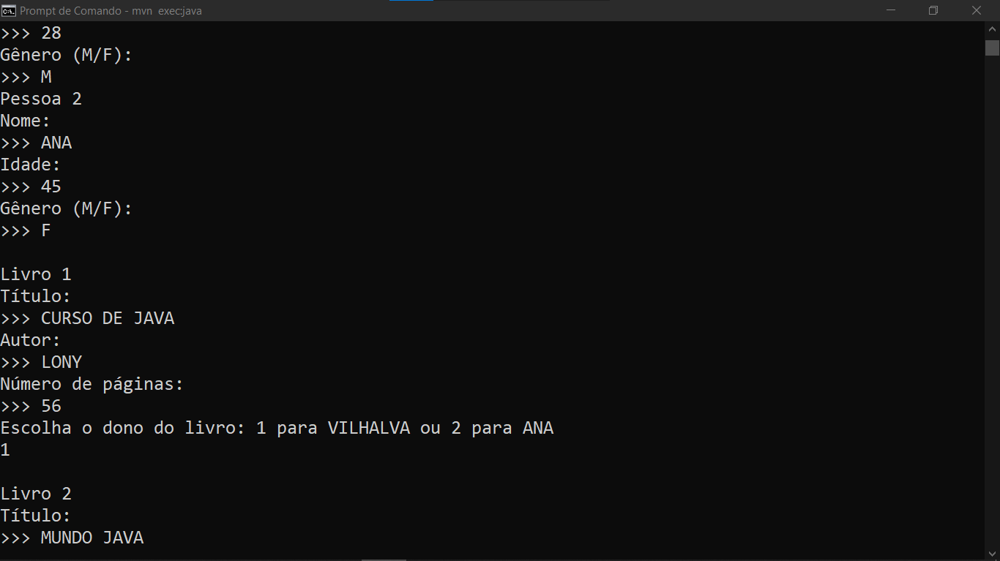

# PROJETO LIVRO
👨‍🏫PROJETO CRIADO PARA O CURSO DE JAVA DO CURSO EM VIDEO.

 <br>

## DESCRIÇÃO:
Este projeto em Java simula um sistema de gerenciamento de **livros** e **pessoas**, onde é possível associar livros a diferentes leitores e realizar algumas ações, como abrir o livro, folhear até uma página específica e avançar para a próxima página. O código utiliza **orientação a objetos** para representar as entidades do sistema (pessoas e livros), demonstrando conceitos de encapsulamento, interação entre objetos e manipulação de atributos via métodos.

## CLASSES UTILIZADAS:
1. **Pessoa**: Representa uma pessoa que pode ler um livro. Cada pessoa tem:
   - **Nome**: O nome da pessoa.
   - **Idade**: A idade da pessoa.
   - **Gênero**: O gênero da pessoa (M/F).

2. **Livro**: Representa um livro, que contém:
   - **Título**: O nome do livro.
   - **Autor**: O nome do autor.
   - **Número de páginas**: A quantidade de páginas no livro.
   - **Pessoa (Leitor)**: A pessoa que está lendo o livro.
   
   O livro tem métodos que permitem interações, como:
   - **abrir()**: Abre o livro.
   - **folhear(int página)**: Folheia o livro até uma página específica.
   - **avancarPag()**: Avança uma página no livro.
   - **detalhes()**: Exibe detalhes do livro e quem está lendo.

## EXECUTANDO O PROJETO:
1. **Certifique-se de que o projeto esteja compilado:**
   Antes de executar o projeto, você deve garantir que ele foi compilado corretamente. Navegue até o diretório `./CODIGO`, e use o seguinte comando para compilar:

   ```bash
   mvn clean install
   ```

2. **Executar o projeto:**
   Para executar a aplicação com o Maven, usando a classe principal definida no seu `pom.xml`, use o comando:

   ```bash
   mvn exec:java
   ```

3. **Interaja com o programa**: 
   - Ao rodar o programa, ele solicitará que você insira informações sobre as **pessoas** e os **livros**:

   1. Primeiro, o programa pede o **nome**, **idade** e **gênero** de cada pessoa.
   2. Depois, ele solicita o **título**, **autor**, **número de páginas** de cada livro e pergunta quem é o **dono** do livro (você escolherá entre as pessoas criadas).
   3. Em seguida, o programa permite que você escolha uma página para folhear no primeiro livro e avança uma página automaticamente.
   4. Por fim, o programa exibe os **detalhes dos livros**.

## CREDITOS:
- [PROJETO CRIADO PARA O CURSO DE JAVA](https://github.com/VILHALVA/CURSO-DE-JAVA)
- [PROJETO FEITO PELO VILHALVA](https://github.com/VILHALVA)


